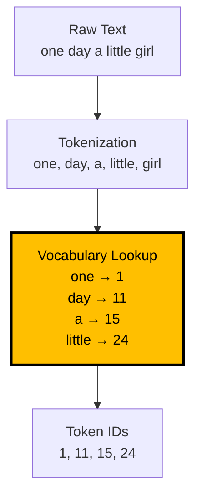
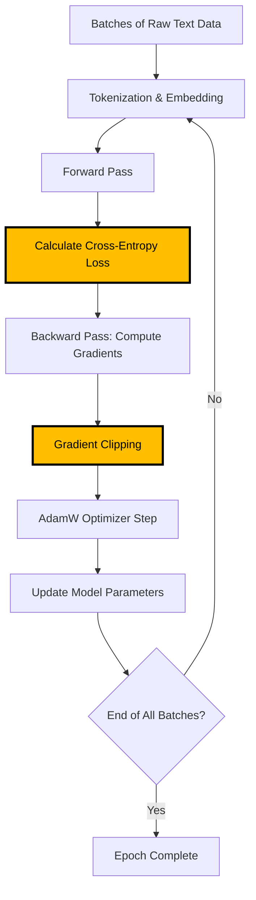
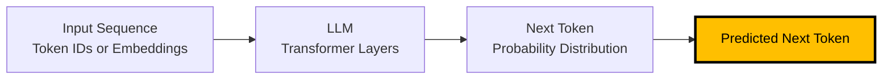
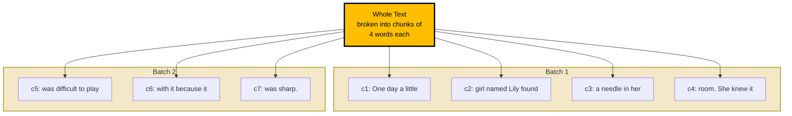
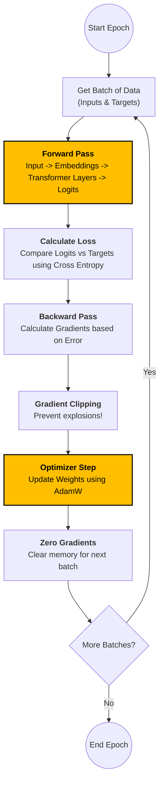

# Understanding the Auto Regressive Models Architecture through a SLM

## Introduction

Before we dive into the details of architecture, what is a small model actually?

- These days we see a lot of large language models (_LLMs_) being published by tech giant's however, these Language Models (_LMs_) barely are capable to be ran locally. Also creating one LLM requires  terabytes of data of text for training.
- To tackle this problem, there is a niche area optimizing the model architectures so that they perform best on a specific/domain problem and produce text on that. Also they don't need huge amounts of data but niche curated dataset for a specific task.
- These language models are called as Small Language Models (_SLMs_)

However the amount of params a SLM should have to call it small is a bit blurry. For the purpose of this blog, we’ll define an SLM as any model with fewer than 1B parameters. While the industry standard for "small" is shifting as hardware improves, 1B is a perfect entry point for understanding the architecture.

- The trend in SLMs is more about Data Quality and Algorithmic Efficiency, somewhat similar to Moore's law. It’s worth noting that we are getting better at "distilling" knowledge into smaller brains, not just waiting for faster chips. 
- 
- Hopefully with a better future, this LLM space also follows the same law with hardware and software optimizations and one day we can even run a GPT-10 on an Android Phone, without any API call to the internet ;)

- The goal of this blog is to gain an understanding of LLMs architecture.
  - Again we will do this briefly to have enough understanding, of LMs internals without going in the depth's of Math's and functions.
  - We will go through the following concepts:
    - How data is prepared for the training purpose
    - What components the LM have, how they contribute to learning the essence of language, and what do the names of components actually come from
    - How do we calculate the loss for the training
    - How do we pre-train the model
    - How do we run inference via the model

---

## Contents

1. Dataset
2. Assembling the Model Architecture
3. Setting up the SLM training.
4. Pre-training the SLM
5. Running Inference.

---

## Dataset

### Collection of Dataset

- For this tutorial we will work with **Tiny Stories Dataset**. It consists of stories for 3-4 yr old kids.
- This dataset was:
  - Intelligently Curated Dataset for specific task of story generation.
    - Likewise, if we want to create a specialized model we have to intelligent curate data for that task.

- With such a dataset what thought process do we have:
  - What type of language model do we develop which learns the essence of the dataset's language.
  - Given we are doing the development of SLM, another thought goes into this process is how small can a model be to learn the language essence and produce text coherently.

- For this blog we will focus on what components go into LM, SLM specifically so that it learns the essence of the language.

- **Learn means:**
  - Learn the structure of language: Subject-Verb-Object (S-V-O) (e.g., "The cat [S] ate [V] the fish [O]").
  - Learn meaning of language: LM should not produce less sensible text for eg., "Blue electrons eat fish."

- Now some characteristics of the dataset:
  - Tiny Stories Dataset has roughly 2M stories.
  - We use 2M stories split to in training and validation set.

Once we have our curated dataset, we would start processing this dataset. This is what we dive into our next part.

### Pre-processing of dataset

#### Tokenization

The first bit of preprocessing the dataset is Tokenization. Computer don't understand words / text, but only numbers.
This process of converting text to numbers (not literally, but numbers are used in understanding the smallest unit of language for computers called `Tokens`), understood by Language models is called as Tokenization.

Following are the Ideas that form the basis of Tokenization:

- Word based Tokenization:
  - English Vocabulary has roughly 600,000 unique words
  - So encoding them to numbers at a given point of time and feeding to LM's will not be easy.
    - This perspective comes from Deep Learning basically, where i/p size always corresponds to the model parameters in one way or the other.
  - Also there will be redundancy for example in word kitten and cat are similar, token and tokenization are also very similar.

- Character Level Tokenization:
  - English language has 26 ideal characters ignoring the punctuations.
  - However, if we think of encoding millions and billions of just character encodings, just to maintain, the language modelling computations will explode, so we even drop this idea.

- Sub-Word Tokenization:
  - We choose the middle ground, which is also known as sub-word tokenization. In here we traverse through all characters one by one across all the text, and then those characters that occur very frequently are coupled.
  - This gives us neither full words nor simple characters, something in between thus it's called sub-word tokenization.
  - One popular algorithm of tokenization used by many researchers from LM space is Byte-Pair Encoding. We can visualize this in the below code snippet.

- Essentially after tokenization the whole chunk of text broken down to tokens. For simplicity let's consider each word as a token itself, this will ease out the explanations and keep things fairly simple.

Eg. `One day a little girl` has 5 words in total. After tokenization, we end up with tokens and their id's. These Id's are nothing but simplest numerical representation for the tokens by the tokenization algorithm. The number of tokens collected here on will be referred to as:

> Vocab Size: The unique tokens collected by the tokenizer. These tokens numerical aspect is the token id.

Now any token of the whole text space is associated with it's IDs.

For our dataset we have 2M Training set and 20K Validation set stories. Using the byte pair encoding tokenizer, we have a vocab size of 50257 and total tokens in the scale of 90 to 100M for training and 10M for validation.

- We store these tokens into .bin file on disk, one for training and one for validation split. This helps us with:
  - Fast data loading,
  - Avoid RAM overload,
  - No need to re-tokenize,
  - This format is easy to use.

- One more optimization that we do during tokenization, is we collect all the tokens batch them and then store them to disk: Tokens $\rightarrow$ Batches $\rightarrow$ Stored to Disk. Batching helps us for faster writes via multiple cores.

### Important Code Lines

- `arr = np.memmap(filename, dtype=dtype, mode='w+', shape=(arr_len,))`, refers to creating a space to store the tokens in numpy array format on disk.
- We first collect all the tokens and then batch them, this allows us for faster writes. This can be seen via `batch = dset.shard(num_shards=total_batches, index=batch_idx, contiguous=True).with_format('numpy')`

## Assembling the Model Architecture

Once we have selected what domain specific data, tokenized the data, we need to now create a specialized small model for a domain. For this we need to define the model architecture that will learn from this data to ideally output coherent language, having similar patterns to the input data.

> Ideally there is lot's of history in the NLP space, before the transformer block came, I will briefly introduce some history in bit's and pieces to fill in the understanding, but leave the depth to my next blog or readers own learning journey ;)

Let's look at how the model architecture looks like:

- There are 3 main blocks in the Model Architecture:
  - Input Block: This block processes the data before feeding it to the model.
  - Processing Block: The essential part which learns the form and meaning from the dataset.
  - Output Block: This block serves the purpose of doing inference/predictions and penalizing the model via loss function.

Before we dive deep into the architecture's individual components let's have a bird's eye view over the whole architecture:

Essentially, in machine learning applications we need some ground-truths from which the model has to infer okay given this input, my goal is to learn the features/patterns in the input and produce whatever output/ground truth the user has shown me during the training.

Likewise in the first input block, we figure out what will be the input to the model and what will be the output to the model, from which it can learn both the form and meaning from the huge amounts of text. We will discuss this in the input/output pair creation section.

> Not ever ML applications require ground truth, some are non-supervised i.e. without any ground truths such as clustering applications. Language modeling is a self-supervised i.e. where the ground-truth is utilized during models learning process and it comes from the i/p itself. For now just knowing that LLMs are mostly trained under self-supervision is enough.

Once we have the input and output, we pass this through the model in batches through multiple iterations, and do some mathematical operations of predictions, loss calculation by comparing how off the predictions are from the actual ground truth and based on this we update the model.

The process somewhat looks like this:

- Tokenization & Batching: Raw text is converted into integers (Tokens). These are organized into a matrix of shape [Batch Size, Sequence Length].
- Forward Pass: The model processes the batch. For every token, it outputs a vector of "logits"—which are essentially raw "confidence scores" for every possible word in the vocabulary.
- Loss Calculation: Using Cross-Entropy Loss, we compare models predicted scores against ground truth i.e. the actual next token in the text.
- Backward Pass (Back-propagation): The "error" is sent backward through the Transformer layers to determine how much each weight contributed to the mistake.
- Gradient Clipping: The gradients are checked. If they are too "steep" (large), they are scaled down to prevent the model from becoming unstable.
- Optimizer Update (AdamW): The optimizer adjusts the weights based on the gradients, also accounting for "momentum" from previous batches.
- Weight Update: The parameters are updated, and the memory of the gradients is cleared for the next batch.
- Repeat: This continues until the data is exhausted (End of Epoch).

Now let's dive deep into each of the block.

### Input Block

In this block, we process the tokens further, before it get's fed to the Transformer block.

- Following processes occur in the Input block:
  - Tokenization: Going from big blobs of text to a unit of text easy to work with, which we have seen above in the pre-processing step.
  - I/P and O/P pairs generation: We generate the ground-truth for language modelling.
  - Token Embeddings
  - Position Embeddings

#### Input Output Pair Creation

As we discussed earlier as Language Modelling is a Machine Learning problem, we need to have input pairs, for training a language model.

> How do we go about finding the ground truth in huge texts? Thinking from the first principles what goal we want to achieve with language models?
> As we think about how humans learn to speak a language, we try to speak one word at a time, thoughtfully thinking about whether it makes sense and is inline to what we spoke before. Similar to this itself, our goal with language models is to predict the next token (instead of word) so that is is inline with the previously predicted tokens both syntactically as well as meaningfully.

As now the task is next token prediction task, the model needs to take in a sequence of tokens process it and produce the next token in that sequence.

- To create these pairs we use something called as context size:
  - Context Length (_CTX_): Max length of tokens language models look at 1 time before predicting the next token.
    > In our examples we use a dummy context size of 4 and a batch size of 4.

For eg. `One day a little girl named Lily found a needle in her room. She knew it was difficult to play with it because it was sharp.` could be broken down as below chunks and batches.

Now once we have chunks, we break down each chunk to input and output pairs as follows:

| i/p | o/p |
| --- | --- |
| One | day |
| One day | a |
| One day a | little |

So the chunk `c1` creates 3 input/output pairs. For the model we use these pairs for the training.

> To get these pairs, first we map a chunk to the chunk which just comes after skipping the first token of the chunk.

This breaking down to pairs we get by simply sliding a window over the chunks we created.  happens during training. In Matrix form it looks like this:

> IMG: I/P output pair

For c1 and y1 we get input output pairs by pairing the _TIDs_,:

- 1 predicts 11 ("One" → "day")
- 1, 11 predicts 15 ("One day" → "a")
- 1, 11, 15 predicts 24 ("One day a" → "little")

> Hence each chunk produces roughly #_CTX_ prediction tasks. So the training objective is as simple as next token prediction for each of the tasks.

As we are doing this next token prediction itself, it's similar to regression, so these models are also called as Auto Regressive Models (_ARMs_), trained via a self-supervised process because we are creating the ground truth from the input data itself.

Now let's move onto the next input processing part, we need to have a better format than token Ids for token representation.

#### Token Embedding Creation

If we think, then the token Ids (_TIDs_) don't capture any meaning about the sentence or for that matter word itself. 24 has no contextual value of `little`, it's simply a number. To tackle this problem itself researches in machine learning space use embeddings.

- Think of embeddings as nothing but a higher dimensional space, where we will find more meaning about with respect to any item's properties/ features. These features are also called as dimensions. The higher the dimensions, the more qualitative/richer the substance is. This richness depends on what each dimension represent and how many dimensions we have. For us living organisms, mother Nature had filled this richness, via millions of years of evolution steps ;).

On the same context to capture the richness of every single word, we associate them with a higher number of dimensions. These dimensions are nothing but randomly initialized numbers, which will be determined by Language Model. The more the LM learn these features/richness well. The better.

Once we have how to represent a tokens richly, we end up with something called as a Token Embedding Matrix (_TEM_). It stores embeddings for all the tokens in a vocabulary/dataset. These embeddings are revised via the language model during the training process, to capture the essence of the word.

> The dimensions is vocab_size x num_embedding_dims. For our examples, we use an embedding dimension of 768 (a standard size for many base Transformer models).

Token embedding matrix serves as a lookup table, initialized randomly and are trainable params for the model.

#### Position Embedding Matrix

Once we have the _TEM_, we need another matrix to capture the essence of the position of words in the sentence. This is done by another high-dimensional feature-capturing matrix called the **Position Embedding Matrix** (_PEM_).

- The _PEM_ has the same `num_embedding_dims` as the _TEM_, but its `num_rows` are equal to the context length (_CTX_).

Once we have the _TIDs_, _TEM_, and _PEM_, we use them to process each token. For every token, we add its embedding vector to its corresponding position vector to get an input vector.

Mathematically, _TEM_ + _PEM_ yields an **Input Embedding Matrix** (_IEM_). This _IEM_ is then passed into the next block of the model architecture.

Without this matrix, our SLM is essentially blind to the order of words. Because Transformers process all tokens in a sequence simultaneously (in parallel), the model sees "The cat ate the fish" and "The fish ate the cat" as identical "bags of words."

To fix this, we "stamp" each token with a positional vector:

- The token "cat" gets a vector that says "I mean 'cat' AND I am the 2nd word."
- This allows the Attention mechanism to understand not just what a word is, but where it is relative to others.

---

### Processing Block

Processing block is the famous `Transformer Block` which consists of attention blocks, which is the critical block of LLM itself.

#### Norm Layer

We now process the _IEM_. by passing it via Norm Layer.

> IMG: Norm layer transformation image

- Doing this helps us to:
  - This helps to stabilize training by stopping gradient explosion.
  - Used to stabilize back-propagation during training.
  - Basically back-propagation depends on gradients which depend on the output of prev. layer in N.N.
  - If the O/P are not of uniform scale & fluctuates bet^n large & small values then the gradient can either stagnate or explode.
  - To avoid this unstable training dynamics, we do layer normalization.
  - Also the O/P distr^n from each layer could change so we normalize it by subtracting the mean from I/P & dividing by standard deviation.
  - This shift of distr^n problem is also called **internal Covariant Shift.**
  - Layer normalization improves training performance.

Note on Pre-Norm: In modern SLMs (like Llama or GPT-3 variants), we usually apply this Normalization before the Attention and FFN layers (Pre-Norm) rather than after. This simple switch makes the training significantly more stable and allows us to train deeper networks without the gradients vanishing.

#### Attention Block

The block where our _SLM_ will actually learn how to produce meaningful short stories with the right form. Before we dive into the implementation part of the attention block, let's see why this is block is necessary in the first place.
Eg. `A dog went to catch a ball, it couldn't catch it.`

- Here first it refers to dog & 2nd one to ball.
- Now if we want to predict next token for `it ...` such a sentence, should `bark` come after it or `flew`.

For us humans this is fairly simple, as we know the context. By context I mean, we know what the `it` refers to, from the previous sentence. In NLP, this is called as deriving attention from the history. This deriving of history is the goal of the attention block. Without this block the _SLM_ would never learn how much attention needs to be paid to chunks of tokens before predicting the next token.

Now let's dive into the working of this block itself.

Attention block does introduce something, that serves similar functionality of introducing higher dimensional space via _IEM_ and _PEM_. We begin with huge set of matrices filled with random numbers & tune these numbers over whole data hoping it will capture the essence i.e. form & meaning of the language.

Attention block captures how each token relates/attends to or gives attention to tokens which come before that token. This info is captured by the attention mechanism. The attention mechanism is responsible to convert the _IEM_ into a Context Vector (_CTXVec_). _CTXVec_ will be later also used in output block for loss calculation.

> IMG: Context Vector formation 2 images.
> IMG: Masked Single Head Self Attention

One crucial note to point out is we haven't changed dimensions  of embeddings from the input block, and it stays 768 in our example until we reach to the very last layer of the output block.

Mathematically, we go from I/P vectors to context vectors is by making use of **Queries, Key & Value matrices weight Matrices.**

- Briefly we take I/P vector embeddings. (4 * 768)
  - Then we multiply them with `query weight matrix` i.e. $W_q$ of dim (768 * 768) & get a `query matrix` of dim (4 * 768)
  - Similarly we multiply input vector embeddings by `key weight matrix` i.e. $W_k$ & get `key matrix` of dim (4 * 768).
  - Lastly likewise we have `value matrix` by multiplying input vector embeddings via a `value weight matrix` i.e. $W_v$

- Here $W_Q, W_K$ & $W_V$ weight matrices are trainable.
- Once we have **attention scores** they are normalized by $sqrt(d_{keys})$, then we apply softmax to get Attention weights.
  - The normalization by key dimensions is to avoid our math get too big which leads to the Softmax function 'saturation' — it starts to pick one winner and ignores everyone else, making it impossible for the model to learn from its mistakes (vanishing gradients).
- The attention weights are multiplied by $V$ to get Context vectors of dim (4 * 768)

The names of query, key and value have origins in the field of information retrieval.

- You have a query: something you're looking for
- The database has keys: tags or identifiers that help you match your query to relevant data.
- Associated with these keys, you have values: the actual information or content you want to retrieve.

This analogy translates directly to attention mechanisms in neural networks:

- Query (Q): The current word or token has a "question" about its context. It asks: "What should I pay attention to?"
- Key (K): Every token provides a "key," acting as a label or signal to answer queries from other tokens. It indicates: "Here's what information I can provide."
- Value (V): Once a match (query-key) is found, this is the actual information provided. It says: "Here's the meaning or content you will get if you attend to me."

- **Another thing to note here is causality.**
  - Basically each token should only know/attend to tokens before it & not after it.
  - So the Attention scores matrix, we need to mask all the scores for tokens that come after a token.

> IMG: Causal attention scores.

- This avoids model peeking into future for next token prediction.
- So we know now why **causal & masked** is a word for the block name. Also the word **self** is used because each token attends to other tokens in its **own sentence**.

> Code Snip: Of the causal attention and so on.

- Regarding masking process of future tokens, we simply set the values above the diagonal to $-inf$, so when we take softmax they go to 0.
- The attention scores are divided by $sqrt$ of Key dims to keep the variance occurring in $Q * K^T$'s dot product should stay as low as possible.
- Then we fill elements above diagonal are replaced with $-\infty$.
- Then we take softmax of $Q * K^T$.
  - This masks token future tokens wrt a token.
  - Ensures the sum of prob. for tokens to be predicted is 1.
- After these operations, since we have `probabilities for next token to be predicted` we can quantitatively estimate how much attention a token has to pay to it's prev. tokens.

**Multi-Head Attention: The Panel of Experts**
Up to this point, we’ve looked at a single "head" of attention. But a single head might focus heavily on syntax (e.g., relating "cat" to "ate"). What if we also want to understand the emotional tone, or pronoun relationships?

Real SLMs use Multi-Head Attention. Instead of one giant query/key/value operation, we split the embedding dimension into multiple smaller "heads" (e.g., 12 heads processing 64 dimensions each).

Think of this like a panel of experts reading the story:

- Head 1 focuses on Grammar (Subject-Verb relationships).
- Head 2 focuses on Context (Is "Bank" a river bank or money bank?).
- Head 3 focuses on Rhyme or Tone.

These heads run in parallel, and their results are concatenated (glued back together) at the end. This allows the model to capture multiple different "perspectives" of the language simultaneously.

#### Dropout

- In the neuron layers we configure another parameter for lazy neuron problem i.e. dropout. Basically we turn off some of the neurons randomly during the training process, the purpose is to utilize all the neurons efficiently and improve generalization performance of the model.

#### Shortcut Connection alternate

After the dropout block we do deep learning trick i.e. addition of shortcut connection:

- A connection added to give another path to flow the gradients & prevent the vanishing gradient problem, that occurs when multiple NN layers are chained together.
- Shortcut connection refers to taking input, just before all the layers occurring before shortcut connection is taken and added to the output produced just before by last layer before shortcut connection in the figure.

#### Feed Forward Network

While the Attention mechanism is the "social" part of the model (tokens talking to each other to gather context), the **Feed Forward Network** (_FFN_) is the "reflective" part. After the first shortcut connection and another layer of normalization, the tokens are passed through this block to refine their individual meanings.

- Many researchers view the _FFN_ as the "knowledge base" where the model stores "facts" or patterns learned from the dataset.
- The Attention layer figures out *which* information is relevant, and the _FFN_ processes that information to deepen the understanding.

This block is often called an **expansion and contraction** layer:

1. **Expansion:** We project the dimensions into a much higher space (e.g., from 768 to 3072). This "upscaling" allows the model to capture complex non-linearities and the nuances of sentence structure.

2. **Contraction:** We then project it back down to the original embedding dimension (768).

> **Example Dimensions:**
> $(4 \times 768) \xrightarrow{\text{Expansion}} (4 \times 3072) \xrightarrow{\text{Contraction}} (4 \times 768)$

> IMG: FF NN.

The activation function used in this network is **GeLU** (Gaussian Error Linear Unit). It is preferred over standard functions like ReLU because it is differentiable at all points and generally yields smoother training dynamics and better performance for LLMs.

> IMG: GeLU neuron unit

---

After the _FFN_, we apply another round of **Dropout** for stability and a final **Shortcut Connection**.

This marks the end of a single **Transformer Block**. In practice, we stack $n$ (e.g., 12, 24, or 36) of these blocks sequentially. By the time the tokens have passed through all blocks, they have been transformed from simple IDs into highly sophisticated, context-aware vectors of 768 dimensions.

> Code Snip

### Output Block

From the processing block, we take the matrix of 768 dim vectors, do a final layer normalization and again pass it through a neural network layer technically called the `Language Model Head (LM Head)`, to bring the 768 dims to vocab dimensions i.e. 50257.

This is also a beautiful symmetry in LLM architectures:
The Token Embedding Matrix at the start and the LM Head at the end are essentially opposites. One turns "ID → Vector," the other turns "Vector → ID scores." In many models, these two actually share the same weights known as `Weight Tying`.

The output from LM Head is logits matrix, which we again pass through a softmax function to get final probabilities. This final matrix is used in loss calculation and after training we will utilize this matrix for quantifying the probability of prediction of next token for the current token, and choose the next token prediction.

The loss calculation Steps look something as follows:

- For every input output pairs, we know the ground truths and the predicted tokens.

| i/p | pred | o/p (ground_truth) |
| --- | ---- | ------------------ |
| One | a | day (TID = 11) |
| One day | little | a (TID = 15) |
| One day a | girl | little (TID = 24) |

Now as the goal is to predict the next token correctly, from the final probability matrix, we consider the probabilities of the correct ground truth i.e. we collect only the probability at the _TIDs_, same as the ground truth i.e. $p_{11}, p_{15}, p_{24}$ and calculate cross entropy loss with these.
So for the above example the loss is:
    $-\frac {1}{4} (log(p_{11}) + log(p_{15}) + log(p_{24}))$
  

### Full Training Loop

Now that we understand the blocks, how do they actually learn? We don't just pass one sentence through; we pass millions, over and over again.

The training loop is the engine that drives the learning. We iterate through our dataset in "Epochs" (one full pass over the data). Inside each epoch, we process the data in batches.

Here is the flow of a single training step:

You might notice the "Optimizer Step" in the chart. We usually use an optimizer called AdamW. Without getting into the math, think of AdamW as a GPS for the model's weights. It tells the parameters exactly which direction to move and how fast to move to reduce the loss (error) most efficiently.

### Running Inference

Once our loss is low and the model is trained, how do we actually use it to write a story? This process is called Inference.

Unlike training, where we feed the whole sentence at once, inference is a loop. The model generates one token, and then we feed that token back into the model to generate the next one. This is why it’s called Auto-Regressive.

The Generation Loop:

- Prompt: We give the model a starting text: "Once upon a time"
- Forward Pass: The model calculates probabilities for the next likely token.
- Sampling: We pick a token from those probabilities.
  - Note: We rarely just pick the #1 highest probability (that makes the model robotic). We introduce a parameter called Temperature.
  - High Temperature (e.g., 1.0): The model takes risks. It might pick a less likely word, leading to more creative (but sometimes nonsense) stories.
  - Low Temperature (e.g., 0.2): The model plays it safe. Ideally for factual tasks.
- Append: We add the chosen token to our input sequence.
- Input becomes: "Once upon a time there"
- Repeat: We run the model again with the new longer input.

How does it stop?
During training, we introduce a special token called <EOS> (End of Sequence). When the model predicts this token during inference, it is essentially saying, "I am finished with the story," and the loop terminates.

And there you have it! From raw text to a "thinking" small language model running on your local machine.

In the next part, we will see which components of an Auto Regressive Model, should we replace to convert it to a diffusion model. Before I finish, I would like to add the steps we discussed necessary in the diffusion model process in our previous blog:

- Nosing: Creation of the noising input via a noising schedule.
- Finding a model that predicts Noise: By predicting noise, doesn't mean predicting actual noise, but the value covered by noise.
- De-noising & generation of output

We will define these step for text based diffusion models and the component changes in ARM required to achieve this.

Until then Sankyu for reading and will be glad to receive your feedback on your thought process about Auto Regressive Models.