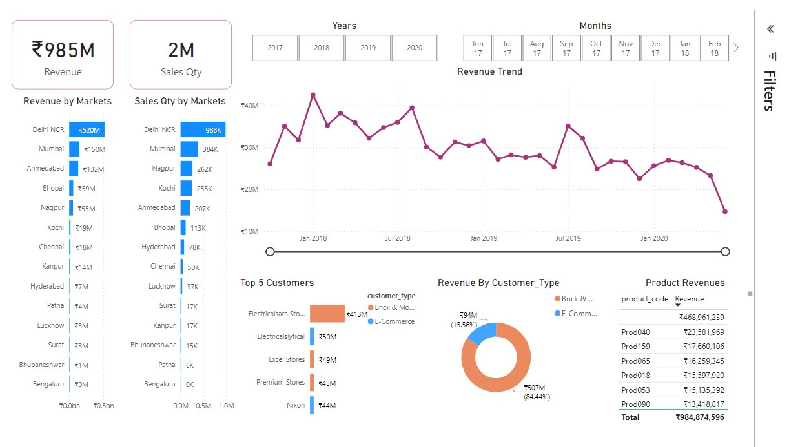

# Data Science Portfolio

This portfolio is a compilation of all Data Related Projects I have done for self-learning and hobby purposes. This portfolio also contains my skills, certs.

- **Email**: [yuvraj.dhepe22@gmail.com](mailto:yuvraj.dhepe22@gmail.com)
- **LinkedIn**: [linkedin.com/yuvraj-dhepe](https://www.linkedin.com/in/yuvraj-shivaji-dhepe/)

## Machine Learning Projects

 **[US Accidents (2016-2023) Severity Prediction Project](https://github.com/Yuvraj-Dhepe/Projects/tree/main/US-Accidents-Project)**

In this ML project I utilized the updated US Accidents dataset(2016-2023) consisting with more than 7 million accident records. The work included perform EDA on the dataset, cleaning the data, to make it suitable for classification, training and comparing various logistic regression algorithms like XGB, Random Forests, Naive Bayes, Logistic Regressor etc.

---

</img> **[Rooftop Classification Image Segmentation Project](https://github.com/Yuvraj-Dhepe/Projects/tree/main/Rooftop_Classification_Project)**

The objective of this project was to come up with a solution for Rooftop Segmentation Problem, with limited dataset of 30 images and 30 labels. In this project I worked on 4 image segmentation models, 2 of which were trained from scratch (CNN, UNET) and rest 2 utilized the potential of Transfer Learning (Vgg16+Unet, MobileNetV2+Unet). The results were quite good 💫 given the less data constraints of this project.

---

 **[Students' Performance End to End Machine Learning Project](https://github.com/Yuvraj-Dhepe/ML_Web_Project)**

This project represents a comprehensive end-to-end machine learning workflow. It encompasses several stages, starting from the initial idea generation and progressing to the design and development of components and pipelines for data analysis, including exploratory data analysis (EDA) and training and comparing regression-based models. The final step involves deploying the model in a production environment on AWS for the purpose of learning. As a result, a fully functional [Gradio app](https://yuvidhepe-studentperformance.hf.space) has been created to enable user interaction, leveraging the capabilities of Hugging Face Spaces for hosting. However, due to cost constraints as a student, hosting the app indefinitely on AWS was not feasible. 😊

## Data Analysis Projects

 **[Power BI AtliQ Hardware Sales Insights](https://yuvraj-dhepe.github.io/DataBlog_V1/docs/projects/B1_Sales_Insights.html)**

This Data Analysis project, I visualize the dummy dataset of AtliQ Hardware sales, to come with interesting insights that a virtual sales director can use to gain insights of his businsess in dynamically growing market. In this project, I perform basic **data cleaning**, **find insights** from the data in SQL, **perform ETL in Power BI** and finally build a comprehensive and Interactive **Power BI Dashboard for user interaction**

---

 **[Youtube API Scraping of Spiritual Channels](https://yuvraj-dhepe.github.io/DataBlog_V1/docs/projects/Youtube_API_EDA.html)**

With millions of users and billions of views, YouTube has become a major platform for spirituality content creators to share their knowledge and insights with a global audience. However, understanding what makes a video successful on YouTube can be a challenge, as the platform’s algorithm is complex and constantly evolving. Aspiring spirituality content creators can benefit from analyzing successful channels in their niche and identifying trends in their topics and presentation styles. In this project, I explore the statistics of 9 popular spirituality channels on YouTube to gain insights on their audience, content, and engagement metrics.
