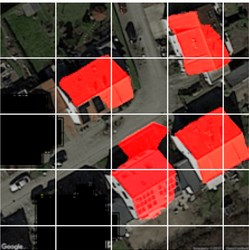

# Data Science Portfolio 
This portfolio is a compilation of all Data Related Projects I have done for self-learning and hobby purposes. This portfolio also contains my skills, certs.
- **Email**: [yuvraj.dhepe22@gmail.com](mailto:yuvraj.dhepe22@gmail.com)
- **LinkedIn**: [linkedin.com/yuvraj-dhepe](https://www.linkedin.com/in/yuvraj-shivaji-dhepe/)

## Machine Learning Projects

</img> **[Rooftop Classification Image Segmentation Project](https://github.com/Yuvraj-Dhepe/Projects/tree/main/Dida_Task)**

The objective of this project was to come up with a solution for Rooftop Segmentation Problem, with limited dataset of 30 images and 30 labels. In this project I worked on 4 image segmentation models, 2 of which were trained from scratch (CNN, UNET) and rest 2 utilized the potential of Transfer Learning (Vgg16+Unet, MobileNetV2+Unet). The results were quite good 💫 given the less data constraints of this project.

---
 **[US Accidents Severity Prediction Project](https://github.com/Yuvraj-Dhepe/Projects/tree/main/US-Accidents%20Project)**

In this ML project I utilized the updated US Accidents dataset(2016-2023) consisting with more than 7 million accident records. The work included perform EDA on the dataset, cleaning the data, to make it suitable for classification, training and comparing various logistic regression algorithms like XGB, Random Forests, Naive Bayes, Logistic Regressor etc.

---
 **[Students' Performance End to End Machine Learning Project](https://github.com/Yuvraj-Dhepe/ML_Web_Project)**

This project represents a comprehensive end-to-end machine learning workflow. It encompasses several stages, starting from the initial idea generation and progressing to the design and development of components and pipelines for data analysis, including exploratory data analysis (EDA) and training and comparing regression-based models. The final step involves deploying the model in a production environment on AWS for the purpose of learning. As a result, a fully functional [Gradio app](https://yuvidhepe-studentperformance.hf.space) has been created to enable user interaction, leveraging the capabilities of Hugging Face Spaces for hosting. However, due to cost constraints as a student, hosting the app indefinitely on AWS was not feasible. 😊

---
[Rooftop Classification Image Segmentation Project](https://github.com/Yuvraj-Dhepe/Projects/tree/main/Dida_Task): 

The objective of this project was to come up with a solution for the Rooftop Segmentation Problem, using a limited dataset of 30 images and 30 labels. In this project, I worked on four image segmentation models, two of which were trained from scratch (CNN, UNET), while the other two utilized Transfer Learning (Vgg16+Unet, MobileNetV2+Unet). The results were quite good given the constraints of the limited data.

---
[US Accidents Severity Prediction Project](https://github.com/Yuvraj-Dhepe/Projects/tree/main/US-Accidents%20Project): 

In this machine learning project, I utilized an updated dataset of US accidents (2016-2023) consisting of over 7 million accident records. The work involved performing exploratory data analysis (EDA), cleaning the data, and training and comparing various logistic regression algorithms such as XGB, Random Forests, Naive Bayes, and Logistic Regressor.

---
[Students' Performance End to End Machine Learning Project](https://github.com/Yuvraj-Dhepe/ML_Web_Project): 

This project represents a comprehensive end-to-end machine learning workflow. It encompasses several stages, starting from the initial idea generation and progressing to the design and development of components and pipelines for data analysis, including exploratory data analysis (EDA) and training and comparing regression-based models. The final step involves deploying the model in a production environment on AWS for the purpose of learning. A fully functional [Gradio app](https://yuvidhepe-studentperformance.hf.space) has been created to enable user interaction, leveraging the capabilities of Hugging Face Spaces for hosting. However, due to cost constraints as a student, hosting the app indefinitely on AWS was not feasible. 😊
