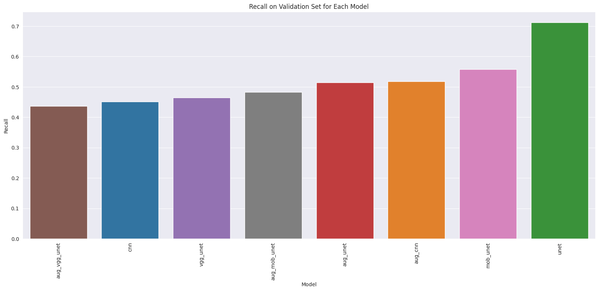
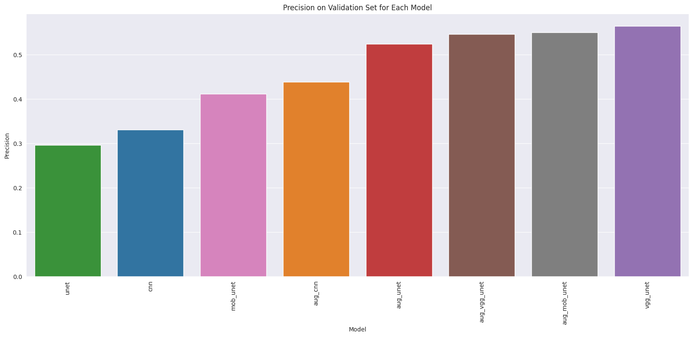
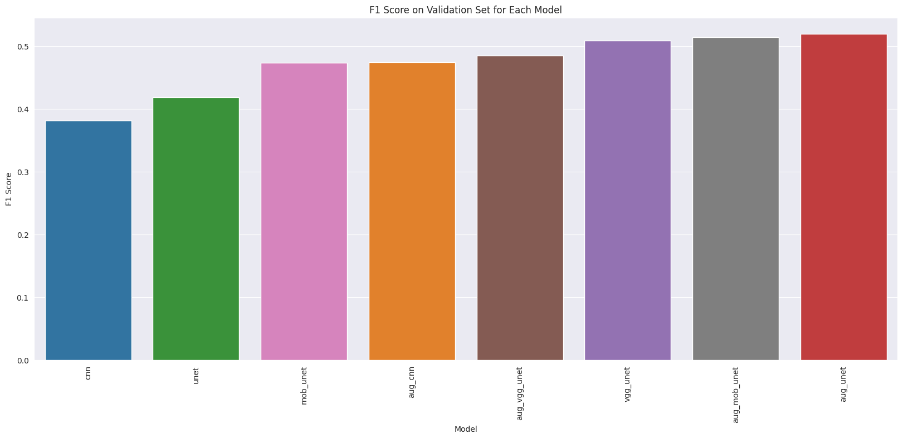
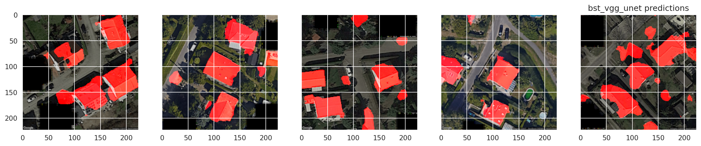
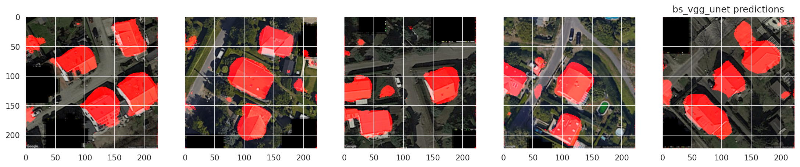

# [Rooftop Classification Computer Vision Project](#t1.)

## Project Organization
```
├── Notes Of Project.md                                        : Notes Taken During EDA
├── Readme.md                                                  : Report
├── Dataset/                                                   : Contains Images used for Model Training
├── images/                                                    : Contains Model Comparision Metric Viz's
└── Rooftop_Classification.ipynb                               : Data Processing & Model Training NB
```

## Motivation and Brief of the Project
This project is a comprehensive work of Rooftop Classification, with limited number of images. This task made use of *only 25 train and 5 test rooftop images with their binary pixeled label variants*. For coming up with a robust ML solution, I tried 4 different image segmentation approaches by making use of 2 models which were **trained from scratch (CNN, UNET)** and 2 models that used **Transfer learning (Vgg16+Unet, MobilenetV2+Unet)**

The project can be divided into 5 major sections (**Details for Every Section are Mentioned in the Ipynb Notebook**):
    - Image Preprocessing & Image Augmentation
    - Splitting of Data for Training, Validation & Testing
    - Model Training & Evaluation of Models on Validation Set
    - Best Models Selection & Re-Training Best Models on Whole Train Data 
    - Evaluation of Models on Test Set Images

## Star Analysis
- Situation: To work on a Computer Vision Project with Limited Amount of Data
- Task: To get the best out of the the dataset at hand to find best segmentation model
- Action: Develop a robust model that can perform well on this segmentation task
- Result: Gain Hands-on experience to make most of limited dataset, learn segmentation concepts and apply them on a real world problem

## Insights from the Data Processing & Model Training
- Few Insights from Data Processing:
    - Images were required to be of **proper dimensions** for neural architecture conv and pooling layers to train on the segmentation task
    - **Image augmentation** improved the performance of models but were **over-fitting a bit on validation data**
    - Binarizing the labels with a threshold and **finding best threshold via ROC Curve** **improved model predictions**
    
- Few Insights from Model Training:
(**aug** refers to models trained on augmented data)    

    - **Simple models** like UNET, CNN trained from Scratch had a pretty good recall on Validation set
    
    - **Complex pre-trained** models like VGG & MobileNet combined with Unet gave good precision on Validation set
    
    - In reality assuming that we don't want to miss presence of rooftops, having FN"s should be penalized highly, so FN should be as low as possible, thus recall has to be the high, however to remain on safe side, I chose to go with **F1-score for selecting best models**.
    
    
- Following are 2 of the Best Models Prediction of Rooftops *on Test Set* after training on whole of **train set** or **augmented train set**
(**bst** refers to models trained on augmented data)
(**bs** refers to models trained on non-augmented data)




## Conclusions 
- After the training with all the given images, a slight imporvement can be spotted in terms of finding a roof, like the roof parts which were not covered fully previously are covered more efficiently
- Also the  models overfitted a bit to this training data, cause we can see red spots to the points where ther are no roofs
- However I believe given small amount of data, this is the best I was able to make of problem statement and NN's, Any Feedbacks are Welcomed

## What Can be improved
- First of all increase in the training samples surely will increase the model's performance
- Different image augmentation can also be tried to improve the same NN's performance
- Trying other image segmentation Neural Networks can improve the segmentation of rooftops

    
    