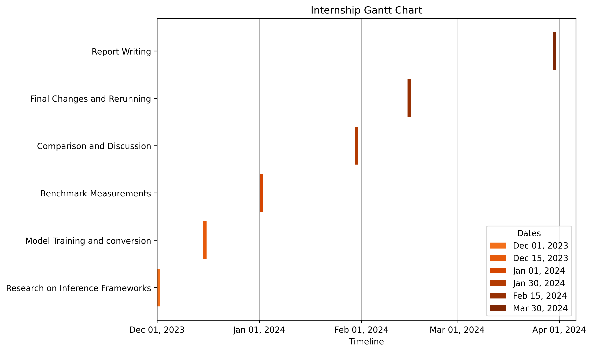

# Internship Project Progress Report

### 1) Research on Inference Frameworks (Deadline: 2023-12-01)
   - Conducting research on key inference frameworks: TensorRT, ONNX Runtime, PyTorch, TensorFlow, and OpenCV.
   - Evaluating their features, strengths, and compatibility for the project's goals.

#### Details
We will focus on popular frameworks i.e. TensorRT, ONNX Runtime, PyTorch, Tensorflow for the beginning of the project. Following are their features, strengths kept in mind for the projects goals
- TensorRT
    - **Features:**
      - **GPU Acceleration:** TensorRT is optimized for NVIDIA GPUs, providing high-performance inference for deep learning models on these devices.
      - **Precision Calibration:** It includes tools for precision calibration, allowing the optimization of models for reduced computational requirements.
      - **Framework Compatibility:** TensorRT supports integration with popular deep learning frameworks like TensorFlow and PyTorch.

    - **Internship Use:**
      - Conduct experiments on NVIDIA GPUs to measure throughput and latency with TensorRT's GPU acceleration.
      - Utilize precision calibration to assess the impact on memory consumption and power consumption for optimized models.
      - Evaluate the ease of integration with TensorFlow and PyTorch models to compare interoperability.

- ONNX Runtime
    - **Features:**
      - **Interoperability:** ONNX Runtime serves as an open-source runtime for models in the ONNX format, enabling interoperability between different deep learning frameworks.
      - **Optimization for CPU and GPU:** It is optimized for both CPU and GPU inference, offering flexibility in deployment across different hardware platforms.
      - **Broad Language Support:** Provides APIs for multiple programming languages, including C, C++, and Python.

    - **Internship Use:**
      - Compare throughput and latency on GPU to assess the optimization for different hardware.
      - Evaluate how ONNX Runtime handles memory consumption across diverse hardware configurations.
      - Test interoperability in various frameworks using the ONNX format (Will be tested, **if required by company** by conversion of same nn in tensorflow and pytorch).

- PyTorch
    - **Features:**
      - **Dynamic Computational Graph:** PyTorch utilizes a dynamic computational graph, making it suitable for dynamic and research-oriented workflows.
      - **TorchScript:** It offers TorchScript for model serialization and deployment, allowing models to be deployed in production environments.
      - **Ease of Use:** PyTorch is known for its flexibility and ease of use, particularly in research settings.
    
    - **Internship Use:**
      - Assess the impact of dynamic computational graphs on throughput and latency in dynamic scenarios.
      - Evaluate the models workflow using pytorch inference & TorchScript, considering factors like memory and power consumption.
      - Explore how the ease of use translates into development efficiency and model deployment.

- TensorFlow
    
    - **Features:**
      - **TensorFlow Lite:** Provides TensorFlow Lite for mobile and edge devices, enabling deployment on resource-constrained platforms.
      - **TensorFlow Serving:** Designed for scalable and production-ready model deployment, facilitating the deployment of models at scale.
      - **Extensive Ecosystem:** TensorFlow boasts a large community and an extensive ecosystem of tools and libraries.
    
    - **Internship Use:**
      - Assess the efficiency of TensorFlow Inference Models using the benchmarks decided

- Overall These points provide a basis for comparing the frameworks in an internship focused on throughput, latency, memory consumption, and power consumption. Experiments and benchmarks will be used to gather concrete data for a comprehensive evaluation.
    
---
### 2) Model Training and Conversion (Deadline: 2023-12-15)
   - Training **Image classification** models (e.g., ResNet, MobileNet) Or **Image detection** algorithms using TensorFlow.
   - Converting trained models for inference compatibility with TensorRT, ONNX Runtime, PyTorch, TensorFlow, and OpenCV.
---
### 3) Benchmark Measurements (Deadline: 2024-01-01)
   - Conducting benchmark measurements with focus on:
      - Throughput
      - Latency
      - Memory Consumption
      - Power Consumption/Efficiency on GPU
   - Analyzing the impact of High-Level & Low-Level Optimizations in Deep Neural Networks (DNN).
---
### 4) Comparison and Discussion (Deadline: 2024-01-30)
   - Analyzing benchmark results and comparing the performance of different inference frameworks.
   - Engaging in discussions with the company stakeholders to gather insights and refine the approach.
---
### 5) Final Changes and Rerunning (Deadline: 2024-02-15)
   - Implementing final changes based on discussions and feedback.
   - Rerunning experiments to validate the effectiveness of the implemented changes.
---
### 6) Report Writing (Deadline: 2024-03-30)
   - Documenting the experiment details, including model training, conversion, benchmarks, and comparisons.
   - Summarizing findings related to throughput, latency, memory, and power consumption.
   - Providing insights into the impact of optimizations on DNN performance.
   - Analyzing and discussing results in the context of project goals and company requirements.
   - Incorporating final changes and presenting a comprehensive report by the deadline.
---
This report outlines the upcoming deadlines and provides a brief overview of the tasks and goals for each project phase.
Following is the Gannt Chart highlighting the deadlines:

